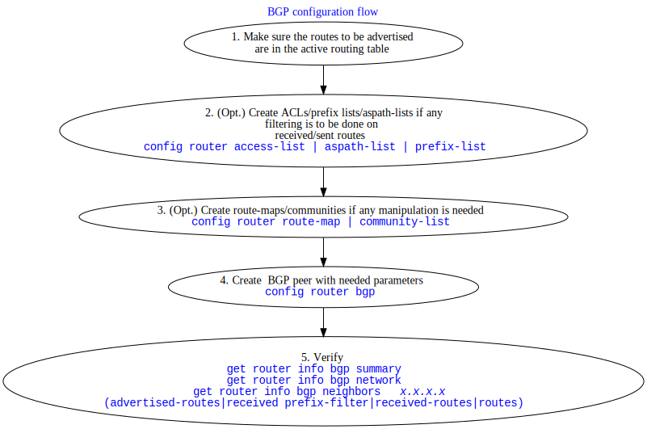
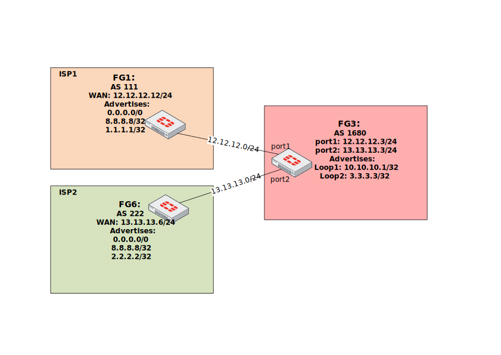
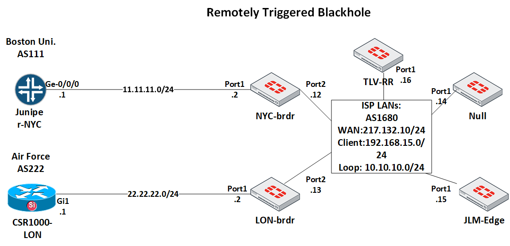

Last updated: August 2020   
PDF version of this post: <a href="Fortigate-BGP-cookbook-of-example-configuration-and-debug-commands.pdf">Fortigate BGP cookbook of example configuration and debug commands.pdf"</a> 


[BGP with two ISPs for multi-homing, each advertising default gateway and full routing table. Uses route-map, prefix list, weight](#ee1)    
[Prevent our Fortigate from becoming a transit AS, do not advertise learned via eBGP routes. Uses route-map, aspath-list](#ee2)   
[Force FG1 to advertise default route without having one in RIB and without using blackhole routing. Uses default-originate](#ee3)    
[Limit announced connected routes to 3.3.3.3 only. Uses route-map with redistribution](#ee4)      
[Secure BGP session between ISP1 and FG3 with one way hash. Uses MD5 authentication](#ee5)  
[Make sure we can see received routing advertisements before and after any filtering is applied. Uses soft reconfiguration](#ee6)       
[Set up BGP peering between FG3 and FG1 using loopback in FG3](#ee7)    
[Remotely Triggered Black Hole Routing configuration](#ee8)


<a name="ee1"></a>
## BGP with two ISPs for multi-homing, each advertising default gateway and full routing table
Task: Configure 2 BGP peerings with different providers, each ISP advertising to us (FG3, AS 1680) both, default and Internet routes. Limit the learned routes from each ISP to default route only. Advertise to both ISPs our internal network of 10.10.10.1, making sure clients on the Internet prefer ISP1 (AS 111) to reach this network. Also we want to use ISP1 to reach the Internet, and only if it fails to use ISP2. 

Solution.  

The BGP configuration flow in general is:




The topology of this case:




**FG3, AS1680:**

- Create prefix list to allow ONLY default route (0.0.0.0/0) and deny everything else. 

```bash
config router prefix-list
    edit "accept-dflt-only"
        config rule
            edit 1
                set prefix 0.0.0.0 0.0.0.0
                unset ge
                unset le
            next
        end
    next
end
```

- Prefer ISP1 to reach the Internet, having ISP2 as backup in case of failure. The easiest way to do so is via `weight` setting, which can be used inside `config neighbor` to set the weight for ALL routes learned from this neighbor. Or it can be used by first `config route prefix-list` to match specific route(s), then setting the weight for these specific matched routes inside `config router route-map`, which in turn will be applied to the neighbor.  The other way would be to increase Local Preference of the routes learned from ISP1, but this would require to configure route-map, an additional extra step.  
Here we are not trying to prefer specific routes via ISP1 but all routes learned from it, so I will set _weight_ on the neighbor.

- The next step is to make sure  my advertised route 10.10.10.1 is reachable via both ISPs, but is preferred by Internet clients via ISP1. Usually you do it by prepending your own AS number to the advertised route(s). I create route-map to do so:

```bash
config router route-map
    edit "prepend-out"
        config rule
            edit 1
                set set-aspath "1680 1680"
            next
        end
    next
end
```


- Now I can configure both BGP peers on FG3, including redistributing the connected networks (here it is 10.10.10.1/32 of the loopback interface) to BGP:  

```bash
config router bgp
    set as 1680
    config neighbor
        edit "12.12.12.12"
            set prefix-list-in "accept-dflt-only"
            set remote-as 111
            set weight 10
        next
        edit "13.13.13.6"
            set prefix-list-in "accept-dflt-only"
            set remote-as 222
            set route-map-out "prepend-out"
        next
    end
    config redistribute "connected"
        set status enable
    end
```

### Verification.  
As remote peers are not configured yet, the status will be oscillating between Active and Connect:

### get router info bgp summary
```bash
FG3-AS1680 # get router info bgp summary
BGP router identifier 10.10.10.1, local AS number 1680
BGP table version is 1
1 BGP AS-PATH entries
0 BGP community entries

Neighbor        V         AS MsgRcvd MsgSent   TblVer  InQ OutQ Up/Down  State/PfxRcd
12.12.12.12     4        111       0       0        0    0    0    never Active     
13.13.13.6      4        222       0       0        0    0    0    never Active     

...

Neighbor        V         AS MsgRcvd MsgSent   TblVer  InQ OutQ Up/Down  State/PfxRcd
12.12.12.12     4        111       0       0        0    0    0    never Active     
13.13.13.6      4        222       0       0        0    0    0    never Connect   
```


**FG1, FG6**.  
BGP settings of both peers are almost identical (except local to each AS number and FG3 peering IP) so I will list just FG1. One note: unlike in _FG3_, which distributes into BGP the directly connected loopback 10.10.10.1, I need both Fortigates here to advertise default route 0.0.0.0/0 which they don't have. As I mentioned in the Configuration Flow graph - BGP will only advertise routes present in the active routing table (RIB) by default. The Fortigate has 2 ways to circumvent this BGP standard requirement: we can announce the default route with `capability-default-originate`, and for other routes we can use `set network-import-check disable`. But I am not using either of them here.   
To satisfy this condition, I add blackhole route to the 0.0.0.0/0 route, in Cisco world it is called "route to Null0". This adds 0.0.0.0/0 as static route which I can redistribute into BGP.  
_Note 1_: Additionally, to simulate "Internet" IPs, I added 8.8.8.8 as loopback in both FG1 and FG6 and redistribute them via `redistribute connected`.

_Note 2_: Important point I glossed over in FG3 is `router-id`. Fortigate (as well as Cisco and most others) will take the highest IP address on the loopback interface available unless explicitly set. In this specific setup I have 8.8.8.8 address on both FG1 and FG6 set on their loopbacks to advertise them as "Internet" addresses to FG3. And this may cause a problem - if any BGP peer detects its own router-id coming from the peer, the BGP session will be torn down with NOTIFICATION sent. So, here it is a must, but generally is a good idea to set `router-id` manually to unique IP address. I will add unique router-id to FG3 and FG6.  

When such situation of duplicate router-id happens, Fortigate will show the error:  

```bash
BGP: 12.12.12.12-Outgoing [DECODE] Open: Invalid Router ID 8.8.8.8
```


 
**FG1**:

```bash
config router static
    edit 1
        set dst 0.0.0.0/0
        set blackhole enable
    next
end
```


### Verification
Note: to save me typing, I add this alias to show routing table:

```bash
config system alias
    edit "rt"
        set command "get router info routing all"
    next
end
```

So when you see it in the output instead of the full command `get router info routing all` know it is an alias, and not a secret hidden command in Fortigate :).

```bash
# alias rt

Routing table for VRF=0
Codes: K - kernel, C - connected, S - static, R - RIP, B - BGP
       O - OSPF, IA - OSPF inter area
       N1 - OSPF NSSA external type 1, N2 - OSPF NSSA external type 2
       E1 - OSPF external type 1, E2 - OSPF external type 2
       i - IS-IS, L1 - IS-IS level-1, L2 - IS-IS level-2, ia - IS-IS inter area
       * - candidate default

S*      0.0.0.0/0 [10/0] is a summary, Null    <--- This is the default route we want to be present in the RIB and now it is.
C       2.2.2.2/32 is directly connected, Loop1
C       8.8.8.8/32 is directly connected, Loop2
C       13.13.13.0/24 is directly connected, port1
```

- Now let's configre the BGP on FG1:

```bash

config router bgp
    set as 111
    set router-id 1.1.1.1
    config neighbor
        edit "12.12.12.3"
            set remote-as 1680
        next
    end
    config redistribute "connected"
        set status enable
    config redistribute "static"
        set status enable
    end
```

## Verification
First, let's see if the BGP peering with two ISPs has been established (yes, it has).  
On FG3:  
```bash
FG3-AS1680 #  get router info bgp summary

BGP router identifier 10.10.10.1, local AS number 1680
BGP table version is 7
3 BGP AS-PATH entries
0 BGP community entries

Neighbor        V         AS MsgRcvd MsgSent   TblVer  InQ OutQ Up/Down  State/PfxRcd
12.12.12.12     4        111     126     297        5    0    0 00:02:35        1
13.13.13.6      4        222     121     288        6    0    0 00:02:12        1

Total number of neighbors 2

```

Let's see if  we are getting default route from both peers:  
### get router info bgp network 0.0.0.0/0

```bash
FG3-AS1680 # get router info bgp network 0.0.0.0/0
BGP routing table entry for 0.0.0.0/0
Paths: (2 available, best #2, table Default-IP-Routing-Table)     <--- Yes, we do
  Advertised to non peer-group peers:
   13.13.13.6                                                     <--- This is not good, read further why
  222
    13.13.13.6 from 13.13.13.6 (6.6.6.6)
      Origin incomplete metric 0, localpref 100, valid, external
      Last update: Wed May 20 12:06:00 2020

  111
    12.12.12.12 from 12.12.12.12 (1.1.1.1)         <--- default route from ISP1
      Origin incomplete metric 0, localpref 100, weight 10, valid, external, best  <--- preferred because its weight is 10
      Last update: Wed May 20 12:05:58 2020                                        <--- the 2nd ISP peer has weight not set, think 0
```

_Now we need to make sure we advertise our network 10.10.10.1 to both peers_:

This is what we advertise to ISP1:  
### FG3-AS1680 #get router info bgp neighbors 12.12.12.12  advertised-routes          
```bash
BGP table version is 3, local router ID is 10.10.10.1
Status codes: s suppressed, d damped, h history, * valid, > best, i - internal
Origin codes: i - IGP, e - EGP, ? - incomplete

   Network          Next Hop            Metric LocPrf Weight RouteTag Path
*> 3.3.3.3/32       12.12.12.3                         32768        0 ?
*> 10.10.10.1/32    12.12.12.3                         32768        0 ?
*> 12.12.12.0/24    12.12.12.3                         32768        0 ?
*> 13.13.13.0/24    12.12.12.3                         32768        0 ?

Total number of prefixes 4
```

Looks good - we advertise 10.10.10.1, as well as other _directly connected_ networks from _port1_, _port2_, and _loopback_.

_And what do we advertise to the ISP2?_  

### FG3-AS1680 # get router info bgp neighbors 13.13.13.6 advertised-routes

```bash
BGP table version is 3, local router ID is 10.10.10.1
Status codes: s suppressed, d damped, h history, * valid, > best, i - internal
Origin codes: i - IGP, e - EGP, ? - incomplete

   Network          Next Hop            Metric LocPrf Weight RouteTag Path
*> 0.0.0.0/0        13.13.13.3                            10        0 1680 1680 111 ?
*> 3.3.3.3/32       13.13.13.3                         32768        0 1680 1680 ?   <--- route-map prepends twice AS 1680 
*> 10.10.10.1/32    13.13.13.3                         32768        0 1680 1680 ?
*> 12.12.12.0/24    13.13.13.3                         32768        0 1680 1680 ?
*> 13.13.13.0/24    13.13.13.3                         32768        0 1680 1680 ?

Total number of prefixes 5
```
As you probably noticed there are too many routes! Indeed we have a problem here - instead of advertising just our (AS 1680)  routes as we do to the ISP1, we advertise also the routes we learned from ISP1 (0.0.0.0/0)! We have become **transit AS** - if ISP2 does not filter incoming from us routes, their clients may potentially reach networks behind ISP1 via us, and for free. Also ISP1 may see our re-advertisements of their routes as BGP hijacking, and be very unhappy about that.  To fix this issue we need to implement route filtering, be it on ISP1 & ISP2 sides, or on our outgoing advertisements. I will look into it in the next scenario.

The good news is that the route-map prepending AS 1680 to make ISP2 less preferred for our network works.

_Let's have a look at the work the `prefix-list` filtering is doing on FG3_. The BGP debug should show it:

### FG3-AS1680 # diagnose ip router bgp level info
Here I set BGP debug level to INFO, as the default level of ERROR will not show enough information. Next I can run the debug.

### diagnose ip router bgp all enable
Unfortunately as the BGP session is already established nothing really happens, so I clear ALL BGP sessions (not something you want to do on production Fortigate lightly):  
### exec router clear bgp all

```bash
BGP: 13.13.13.6-Outgoing [FSM] State: OpenConfirm Event: 26
id=20300 logdesc="BGP neighbor status changed" msg="BGP: %BGP-5-ADJCHANGE: neighbor 13.13.13.6 Up "   <--- The BGP session with ISP2 is established
BGP: 13.13.13.6-Outgoing [DECODE] Update: NLRI Len(15)
BGP: 13.13.13.6-Outgoing [FSM] State: Established Event: 27
BGP: 13.13.13.6-Outgoing [RIB] Update: Received Prefix 0.0.0.0/0                  <--- And here we can see prefix-list filtering
BGP: 13.13.13.6-Outgoing [RIB] Update: Prefix 13.13.13.0/24 denied due to filter  <--- in action , 0.0.0.0/0 is accepted but
BGP: 13.13.13.6-Outgoing [RIB] Update: Prefix 8.8.8.8/32 denied due to filter     <--- the rest of received routes are discarded
BGP: 13.13.13.6-Outgoing [RIB] Update: Prefix 2.2.2.2/32 denied due to filter
```

Disable all debug:  

### diagnose debug reset


<a name="ee2"></a>  
## Prevent our Fortigate from becoming a transit AS, do not advertise learned via eBGP routes.
As seen in the previous case, without any filtering on FG3 everything it learns from its BGP peers and is being installed in its routing table will be advertised to all the BGP peers. 

We can prevent it in few ways:  
- Filter outgoing advertisements to include only our networks by IPs (not very scalable, but granular)  
- Filter outgoing advertisements using AS number (much more scalable, but not granular)

First is to explicitly allow our own networks in outgoing advertisements and block everything else.
 About blocking everything else - both prefix lists and ACLs have implicit deny any any, so it is not necessary to explicitly deny everything else. 

### Matching networks using prefix lists
Prefix lists use Prefix (network) and the Prefix Length (subnet mask length in bits) to look at when comparing the routes.  
Some examples of using prefix lists:

<table class="w3-table w3-striped w3-border">
<tr class="w3-green">
<th>Prefix </th>
<th> What matches</th>
</tr>
<tr>
<td> 0.0.0.0/0 le 32</td>
<td> Matches ANY prefix of ANY length</td>
</tr>
<tr>
<td>0.0.0.0/0  ge 24 le 24</td>
<td>Matches ANY network/prefix with subnet 24 bits long</td>
</tr>
<tr>
<td> 0.0.0.0/0 ge 24</td>
<td> Matches any network with subnet mask of 24 bits or longer. Usually used by uplink providers to block incoming routes which are too specific, for preserving manageable size of the routing table.
</td>
</tr>
<tr>
<td>0.0.0.0/0 </td>
<td>Matches default route only</td>
</tr>
<tr>
<td> 10.0.0.0/8</td>
<td>Matches </td>
</tr>
<tr>
<td> 13.13.0.0/16 ge 25 </td>
<td> Match any network prefix in range of 13.13.0.0/16 i.e. from 13.13.0.0 to 13.13.255.255, provided it also has bit mask length of 25 bits or longer. E.g. 13.13.123.0/25, 13.13.123.128/25 but not 13.13.0.0/24</td>
</tr>
<tr>
<td> 13.13.0.0/16 ge 25 le 30</td>
<td> Match networks in range of 13.13.0.0 - 13.13.255.255 with bit mask of 25 or longer up to and including 30 bits.</td>
</tr>


</table>

The following prefix-list will allow just networks 10.10.10.1/32 and 3.3.3.3/32:

```bash
config router prefix-list
    edit "own-nets-only-out"
        config rule
            edit 1
                set prefix 10.10.10.1 255.255.255.255
                unset ge
                unset le
            next
            edit 2
                set prefix 3.3.3.3 255.255.255.255
                unset ge
                unset le
            next
        end
    next
```

What is left is to apply the prefix list outbound to both peers on FG3:

```bash
config router bgp
    set as 1680
    config neighbor
        edit "12.12.12.12"
            set prefix-list-in "accept-dflt-only"
            set prefix-list-out "own-nets-only-out"
            set remote-as 111
            set weight 10
        next
        edit "13.13.13.6"
            set prefix-list-in "accept-dflt-only"
            set prefix-list-out "own-nets-only-out"
            set remote-as 222
            set route-map-out "prepend-out"
        next
    end
```

The advertised routes before:

```bash
FG3-AS1680 # get router info bgp neighbors 13.13.13.6 advertised-routes

   Network          Next Hop            Metric LocPrf Weight RouteTag Path
*> 0.0.0.0/0        13.13.13.3                            10        0 1680 1680 111 ?
*> 3.3.3.3/32       13.13.13.3                         32768        0 1680 1680 ?
*> 10.10.10.1/32    13.13.13.3                         32768        0 1680 1680 ?
*> 12.12.12.0/24    13.13.13.3                         32768        0 1680 1680 ?
*> 13.13.13.0/24    13.13.13.3                         32768        0 1680 1680 ?

Total number of prefixes 5

FG3-AS1680 #get router info bgp neighbors 12.12.12.12  advertised-routes          

BGP table version is 3, local router ID is 10.10.10.1
Status codes: s suppressed, d damped, h history, * valid, > best, i - internal
Origin codes: i - IGP, e - EGP, ? - incomplete

   Network          Next Hop            Metric LocPrf Weight RouteTag Path
*> 3.3.3.3/32       12.12.12.3                         32768        0 ?
*> 10.10.10.1/32    12.12.12.3                         32768        0 ?
*> 12.12.12.0/24    12.12.12.3                         32768        0 ?
*> 13.13.13.0/24    12.12.12.3                         32768        0 ?

Total number of prefixes 4

```


And after applying the prefix list:


```bash
FG3-AS1680 # get router info bgp neighbors 13.13.13.6 advertised-routes 

   Network          Next Hop            Metric LocPrf Weight RouteTag Path
*> 3.3.3.3/32       13.13.13.3                         32768        0 1680 1680 ?
*> 10.10.10.1/32    13.13.13.3                         32768        0 1680 1680 ?

Total number of prefixes 2


FG3-AS1680 # get router info bgp neighbors 12.12.12.12  advertised-routes

   Network          Next Hop            Metric LocPrf Weight RouteTag Path
*> 3.3.3.3/32       12.12.12.3                         32768        0 ?
*> 10.10.10.1/32    12.12.12.3                         32768        0 ?

Total number of prefixes 2
```

Also note that to ISP2 peer both networks are advertised with AS 1680 prepended, this is because route-map is applied latest in the incoming/outgoing routes processing.


## Matching networks using AS PATH list
BGP advertised routes bear with them quite a lot of information on which we can match/filter and do other manipulation to our liking. One of the **Well-known mandatory** (i.e. present in EVERY route advertisement/withdrawal in BGP, the others being <b>ORIGIN</b>,  and <b> NEXT_HOP</b>) is the <b>AS_PATH</b> attribute. So we can use it to allow advertising only our own routes with AS PATH lists.
AS path lists use regular expressions to match the AS numbers in the path. The regex differs slightly from the familiar PCRE/sed. Special symbols understood:

 <table class="w3-table w3-striped w3-border">
<tr class="w3-green">
<th>Symbol</th>
<th> What matches</th>
</tr>
<tr>
<td>. </td>
<td>Any single character, including space</td>
</tr>
<tr>
<td>*</td>
<td>Zero or more instance of preceding pattern</td>
</tr>
<tr>
<td>+</td>
<td> One or more instance of preceding pattern</td>
</tr>
<tr>
<td> ? </td>
<td> Zero or one instance of preceding pattern</td>
</tr>
<tr>
<td> ^</td>
<td> Beginning of the string. Also can be used to  negate inside class [^ ]</td>
</tr>
<tr>
<td> $</td>
<td> End of the string</td>
</tr>
<tr>
<td>  _ </td>
<td> (Underscore, special for AS Path lists) Matches comma, left brace (`{`), right brace (`}`), left parenthesis, right parenthesis, beginning of the string, end of the string, and a space.
</td>
</tr>
<tr>
<td> [ ] </td>
<td> Range of characters, can use `-` to skip specifying all the range.</td>
</tr>
 
</table>


Let's look at some examples of matching AS numbers.
<table class="w3-table w3-striped w3-border">
<tr class="w3-green">
<th>AS PATH  regex</th>
<th> What matches</th>
</tr>
<tr>
<td> `^$`  </td>
<td> Local routes only. In other words - match routes with empty AS path. </td>
</tr>
<tr>
<td>` .* `</td>
<td> All and any routes </td>
</tr>
<tr>
<td> `^111$` </td>
<td> Routes originating from a directly attached peer, i.e routes that have just one AS number in their path. Here it is routes originated by ISP1 (AS 111).</td>
</tr>
<tr>
<td> ` _111$` </td>
<td> Routes originated by the specified AS, but not necessarily learned directly from the source AS. If the given AS 111 advertises its routes to say AS 333, and we have peering with this AS 333, then we could learn routes from AS 333 that were originated by AS 111 and their AS path would look `333 111`, and they would be matched.    Also, we don't impose length limit on AS path here, so the path `777 999 333 111` would match as well.</td>
</tr>
<tr>
<td> ` _111_ ` </td>
<td> Routes that passed on their way the specified AS, without looking in which order.  This will match routes with AS paths like: `333 111 777 999`, `111 777`, `111` (see table above as `_` will match as `$` and `^` as well) </td>
</tr>
</table>


Now back to our FG3, let's create and apply AS path list filtering to advertise only our own nets to the BGP peers.

Step 1. Create aspath-list matching local routes:

```bash
config router aspath-list

    edit "LocalRoutesOnly"
        config rule
            edit 1
                set action permit
                set regexp "^$"
            next
        end
    next
end
```

Step 2. Create if needed (for ISP1) and/or edit existing route-map (for ISP2 there is already `prepend-out` for prepending AS) that uses the aspath-list for matching.


```bash

config router route-map
    edit "prepend-out"
        config rule
            edit 1
                set match-as-path "LocalRoutesOnly"    <-- adding the match for local routes only
                set set-aspath "1680 1680"
            next
        end
    next

    edit "LocalRoutesOut"
        config rule
            edit 1
                set match-as-path "LocalRoutesOnly"
            next
        end
    next
end
```


Step 3. Finally, apply route-map LocalRoutesOut to ISP1 and refreshing BGP session with ISP2 to activate the changes.

```bash
config router bgp
    set as 1680
    config neighbor
        edit "12.12.12.12"
            set prefix-list-in "accept-dflt-only"
            set remote-as 111
            set route-map-out "LocalRoutesOut"  <-- I removed here prefix-list ""own-nets-only-out"
" as unnecessary anymore
            set weight 10
        next
        edit "13.13.13.6"
            set prefix-list-in "accept-dflt-only"
            set remote-as 222
            set route-map-out "prepend-out"
        next
    end
    config redistribute "connected"
        set status enable
    end
```

### Verification
ISP1, routes received from FG3:

```bash
FG1-AS111 # get router info bgp neighbor 12.12.12.3 routes

   Network          Next Hop            Metric LocPrf Weight RouteTag Path
*> 3.3.3.3/32       12.12.12.3               0             0        0 1680 ?
*> 10.10.10.1/32    12.12.12.3               0             0        0 1680 ?
*  12.12.12.0/24    12.12.12.3               0             0        0 1680 ?
*> 13.13.13.0/24    12.12.12.3               0             0        0 1680 ?
```

ISP2:  

```bash
FG6-AS222 # get router info bgp neighbors 13.13.13.3 routes

   Network          Next Hop            Metric LocPrf Weight RouteTag Path
*> 3.3.3.3/32       13.13.13.3               0             0        0 1680 1680 1680 ?
*> 10.10.10.1/32    13.13.13.3               0             0        0 1680 1680 1680 ?
*> 12.12.12.0/24    13.13.13.3               0             0        0 1680 1680 1680 ?
*  13.13.13.0/24    13.13.13.3               0             0        0 1680 1680 1680 ?

```


### Matching networks using ACLs
Lastly, for the completeness sake, let's do the filtering with ACLs. The major issue with ACLs is that the pain is not worth the gain - they are not intuitive, and you spend more time calculating needed ACL wildcards than actually configuring them. And all that for no advantage whatsoever over the prefix lists. ACLs in BGP context appeared like 20 years ago in Cisco, before the prefix lists were available, and ever since they are supported for no obvious reason (to me, except one - for CCIE R&S exam  where Cisco folks love to use them to confuse/make suffer the candidates). Fortinet, probably not to feel outdone, implemented it as well. I, personally, have never seen them being used in real life.

So, matching our loopback networks 3.3.3.3/32, 10.10.10.1/32, and directly attached 12.12.12.0/24, and 13.13.13.0/24 with ACls will look like:

```bash
config router access-list
    edit "own-nets-only"
        config rule
            edit 1
                unset prefix   <-- Funny thing, even though inside ACL, still Fortigate allows us to use
 prefix with subnet mask as in prefix-lists, i.e. 10.10.10.1/32 
                set wildcard 10.10.10.1 0.0.0.0
            next
            edit 2
                unset prefix
                set wildcard 3.3.3.3 0.0.0.0
            next
            edit 3
                unset prefix
                set wildcard 12.12.12.0 0.0.0.255
            next
            edit 4
                unset prefix
                set wildcard 13.13.13.0 0.0.0.255
            next
        end
    next
end
```

Step 2: create route-map to use the ACL (only for ISP1).

```bash
config router route-map
    edit "LocalOutACL"
        config rule
            edit 1
                set match-ip-address "own-nets-only"
            next
        end
    next
end
```

For ISP1 I will use the existing route-map "prepend-out".

Step 3: apply the route-map in outbound direction.

```bash
FG3-AS1680 # show router bgp
config router bgp
    set as 1680
    config neighbor
        edit "12.12.12.12"
            set prefix-list-in "accept-dflt-only"
            set remote-as 111
            set route-map-out "LocalOutACL"
            set weight 10
        next
        edit "13.13.13.6"
            set prefix-list-in "accept-dflt-only"
            set remote-as 222
            set route-map-out "prepend-out"
        next
    end

```


<a name="ee3"></a>  
## Force FG1 to advertise default route without having one in RIB and without using blackhole routing. Uses default-originate
Fortigate can advertise the default route to its peers, even if there is no such route in by using `capability-default-originate enable` command
under the neighbor configuration.


```bash
FG1-AS111 # show router bgp
config router bgp
    set as 111
    set router-id 1.1.1.1
    config neighbor
        edit "12.12.12.3"
            set capability-default-originate enable    <-- This will cause FG1 to advertise 0.0.0.0/0
            set remote-as 1680
        next
    config redistribute "static"
    end
```


Verify:

```bash
FG1-AS111 # get router info bgp neighb 12.12.12.3 advertised-routes
   Network          Next Hop            Metric LocPrf Weight RouteTag Path
*> 0.0.0.0/0        12.12.12.12                   100  32768        0 i
*> 1.1.1.1/32       12.12.12.12                        32768        0 ?
*> 8.8.8.8/32       12.12.12.12                        32768        0 ?
*> 12.12.12.0/24    12.12.12.12                        32768        0 ?
```


<a name="ee4"></a>  
## Limit announced connected routes to 3.3.3.3 only. Uses route-map with redistribution
Redistribute statements under router BGP  configuration support using route-maps to limit what routes get distributed into BGP and which do not.
Let's limit the routes FG1 announces to just 3.3.3.3/32 of its loopback.

Step 1 Create prefix list to match the route:

```bash
config router prefix-list
    
    edit "allow-3.3.3.3-only"
        config rule
            edit 1
                set prefix 3.3.3.3 255.255.255.255
                unset ge
                unset le
            next
        end
```

Step 2 Update/create route-map to use the prefix-list.

```bash

    edit "redist-3.3.3.3-only"
        config rule
            edit 1
                set match-ip-address "allow-3.3.3.3-only"
            next
        end
    next

```

Step 3 Use this route-map.

```bash
config router bgp
    config redistribute "connected"
        set status enable
        set route-map "redist-3.3.3.3-only"
    end
```


<a name="ee5"></a>  
## Secure BGP session between ISP1 and FG3 with one way hash. Uses MD5 authentication
BGP has MD5 hashing to prevent adversary changes to the advertisements and potential DDoS attack by sending TCP RST packets (to sabotage an existing and legal session).  
Naturally, you have to configure the same password on both BGP peers. The configuration itself is one line under neighbor configuration - `password`. 
E.g. FG3:

```bash
    config neighbor
        edit "12.12.12.12"
            set remote-as 111
            set route-map-out "LocalOutACL"
            set weight 10
            set password secretsuperpassword
```

More interesting though is to see what happens when misconfiguration occurs.

**Case 1 FG3 has the password set, FG1 has not**.
As BGP RFC requires, the peer with BGP authentication enabled should drop and NOT acknowledge or give any other information when it receives unauthenticated packet. So, basically BGP sessions times out:  

```bash
FG3-AS1680 # diagnose ip router bgp level info
FG3-AS1680 # diagnose ip router bgp all enable


```

```bash
FG1 (on which I initiated BGP session reset):

BGP: 12.12.12.3-Outgoing [ENCODE] Msg-Hdr: Type 3 <-- Type 3 is NOTIFICATION
BGP: %BGP-3-NOTIFICATION: sending to 12.12.12.3 6/0 (CeaseUnspecified Error Subcode) 0 data-bytes []

FG1-AS111 # BGP: [GRST] Timer Announce Defer: Check
id=20300 logdesc="BGP neighbor status changed" msg="BGP: %BGP-5-ADJCHANGE: neighbor 12.12.12.3 Down BGP Notification CEASE"
id=20300 logdesc="BGP neighbor status changed" msg="BGP: %BGP-5-ADJCHANGE: neighbor 12.12.12.3 Down User reset"
BGP: 12.12.12.3-Outgoing [FSM] State: Idle Event: 3   <-- This Fortigate falls back to Idle state


FG3-AS1680: (pretty much the same)

BGP: 12.12.12.12-Outgoing [ENCODE] Msg-Hdr: Type 3
BGP: %BGP-3-NOTIFICATION: sending to 12.12.12.12 4/0 (Hold Timer Expired/Unspecified Error Subcode) 0 data-bytes []
BGP: [GRST] Timer Announce Defer: Check
id=20300 logdesc="BGP neighbor status changed" msg="BGP: %BGP-5-ADJCHANGE: neighbor 12.12.12.12 Down Hold Timer Expired"
id=20300 logdesc="BGP neighbor status changed" msg="BGP: %BGP-5-ADJCHANGE: neighbor 12.12.12.12 Down BGP Notification FSM-ERR"
```

After that, there is nothing to point on mismatch in authentication session, but just time out:

```bash
FG1-AS111 #
BGP: 12.12.12.3-Outgoing [NETWORK] FD=21, Sock Status: 110-Connection timed out
BGP: 12.12.12.3-Outgoing [FSM] State: Connect Event: 18

FG3-AS1680 #
BGP: 12.12.12.12-Outgoing [NETWORK] FD=23, Sock Status: 110-Connection timed out
BGP: 12.12.12.12-Outgoing [FSM] State: Connect Event: 18

```

**Case 2: One of the peers has wrong password set**.

Well, here we have no clue from the Fortigate as well, just the same connection time out:

```bash
BGP: %BGP-3-NOTIFICATION: sending to 12.12.12.3 4/0 (Hold Timer Expired/Unspecified Error Subcode) 0 data-bytes []
BGP: [GRST] Timer Announce Defer: Check
id=20300 logdesc="BGP neighbor status changed" msg="BGP: %BGP-5-ADJCHANGE: neighbor 12.12.12.3 Down Hold Timer Expired"
id=20300 logdesc="BGP neighbor status changed" msg="BGP: %BGP-5-ADJCHANGE: neighbor 12.12.12.3 Down BGP Notification FSM-ERR"

BGP: 12.12.12.3-Outgoing [NETWORK] FD=21, Sock Status: 110-Connection timed out
BGP: 12.12.12.3-Outgoing [FSM] State: Connect Event: 18
```


<a name="ee6"></a>  
## Make sure we can see received routing advertisements before and after any filtering is applied. Uses soft reconfiguration

The inconvenience of not seeing received from a peer routes before we apply local manipulation/filtering actions can be fixed with **soft reconfiguration**, which is disabled by default. 
This feature, once enabled, forces Fortigate to keep in memory all received routes from the neighbor BEFORE any local filtering is being applied. The downside is that  memory consumption goes up. 
Today, this functionality  is only good as visual aid in debugging the changes situations because **route refresh** capability (details here <a href="https://tools.ietf.org/html/rfc2918" target=_blank rel="noopener">RFC 2918</a> and <a href=https://tools.ietf.org/html/rfc7313 target=_blank rel="noopener">RFC 7313</a>)  is by default enabled in Fortigate, so any changes to the BGP policy we make on Fortigate are applied almost immediately (few seconds delay). 

Still, the feature is there and we can enable with  ` soft-reconfiguration enable `.

```bash
FG3-AS1680 (neighbor) # show
config neighbor
    edit "12.12.12.12"
        set soft-reconfiguration enable
        set remote-as 111
        set route-map-out "LocalOutACL"
        set prefix-list-in "accept-dflt-only"
        set weight 10
    next
```

Now we can query for routes received from 12.12.12.12 (ISP1) BEFORE the policy _accept-dflt-only_ is applied allowing just default route :

BEFORE filtering is applied:

```bash
FG3-AS1680 # get router info bgp neighbors 12.12.12.12  received-routes

   Network          Next Hop            Metric LocPrf Weight RouteTag Path
*> 0.0.0.0/0        12.12.12.12                            0        0 111 i
*> 1.1.1.1/32       12.12.12.12                            0        0 111 ?
*> 8.8.8.8/32       12.12.12.12                            0        0 111 ?
*> 12.12.12.0/24    12.12.12.12                            0        0 111 ?

Total number of prefixes 4
```

And AFTER:
```bash
FG3-AS1680 # get router info bgp neighbors 12.12.12.12  routes

   Network          Next Hop            Metric LocPrf Weight RouteTag Path
*> 0.0.0.0/0        12.12.12.12              0            10        0 111 i

Total number of prefixes 1
```


<a name="ee7"></a>  
## Set up BGP peering between FG3 and FG1 using loopback in FG3
In production you use loopbacks as source interface for BGP sessions  mostly to ensure continuous BGP peering in case the physical link to the BGP peer goes down. In this case, if you have redundant links/paths to the same BGP peer via other, still functional interfaces, the BGP session will work uninterrupted.

In loopback as source interface case you have to account for 2 things:

- Loopback is an interface by all means, so you have to add security rules to allow traffic (TCP port 179 in BGP's case) to/from it for BGP session to be established. The rule from loopback outbound is enough for Fortigate to be BGP client, always establishing connection to the peer.  
- Loopback adds 1 routing hop so for eBGP sessions you have to enable eBGP multihop for session to come up. You do it on the remote peer at least.

Configure FG3.  
Configure security rule to allow outgoing from Loop2 connections:

```bash
configure firewall policy
        set srcintf "Loop2"
        set dstintf "port1"
        set srcaddr "all"
        set dstaddr "all"
        set action accept
        set status enable
        set schedule "always"
        set service "ALL"
    next
```

The BGP neighbor configuration to use Loop2 as the source interface:

```bash
config router bgp
    set as 1680
    config neighbor
        edit "12.12.12.12"
            set soft-reconfiguration enable
            set interface "Loop2"
            set prefix-list-in "accept-dflt-only"
            set remote-as 111
            set route-map-out "LocalOutACL"
            set update-source "Loop2"   <-- This causes FG3 to source BGP packets from Loop2
            set weight 10
        next
```

Configuration of FG1.  
Create new peer with ip of  3.3.3.3 and add the multi-hop capability:

```bash
config router bgp
    set as 111
    set router-id 1.1.1.1
    config neighbor
        next
        edit "3.3.3.3"
            set capability-default-originate enable
            set ebgp-enforce-multihop enable
            set remote-as 1680
        next
    end
```

### Verification
To see that FG3 is indeed client and FG1 (12.12.12.12) is server for this peering:  

### diagnose sys tcpsock | grep 179

```bash
FG3-AS1680 # diag sys tcpsock | grep 179
0.0.0.0:179->0.0.0.0:0->state=listen err=0 sockflag=0x1 rma=0 wma=0 fma=0 tma=0
3.3.3.3:21989->12.12.12.12:179->state=estabilshed err=0 sockflag=0x1 rma=0 wma=0 fma=0 tma=0
13.13.13.3:3345->13.13.13.6:179->state=estabilshed err=0 sockflag=0x1 rma=0 wma=0 fma=0 tma=0
```

Multi-hop neighbor enabled:  

```bash
FG1-AS111 #  get router info bgp neighbors 
BGP neighbor is 3.3.3.3, remote AS 1680, local AS 111, external link
  BGP version 4, remote router ID 10.10.10.1
  BGP state = Established, up for 00:13:42
   ....
  External BGP neighbor may be up to 255 hops away. <-- Multi hop setting is active
Local host: 12.12.12.12, Local port: 179
Foreign host: 3.3.3.3, Foreign port: 21989
```


<a name="ee8"></a>
## Remotely Triggered Black Hole Routing configuration
Task: Build RTBH solution for ISP on Fortigate firewalls only. The solution will include the trigger Fortigate named *Null*, client facing PE Fortigate *JLM-Edge*, Route Reflector for iBGP peerings *TLV-RR*, and 2 border Fortigates, each connected to Tier 1 uplinks: *NYC-brdr* and *LON-brdr*.  The solution will enable an operator to  remove the attacked/victim network from the backbone and block all incoming packets to it on bordes. Additionally, the operator will have the choice to withdraw the network  either on London or NYC border separately, or on both.   Also, it will be possible to block a route inside the Backbone only.  
To verify the configuration, we will assume the client's network IP of 192.168.15.15/32 is under a DDoS  attack, and we want withdraw it from the baclbone routing tables without affecting the whole class C 192.168.15.0/24 network of the client.

NOTE: All IPs/ASes/Names are fictitious. 

The workflow for the operator should be: She receives alert on client's network being attacked. She enters *Null* Fortigate and sets static route to the network choosing where border-wise she wants to block the attacked network.

The diagram for this scenario:



The solution here will adhere to the <a href="https://www.cisco.com/c/dam/en_us/about/security/intelligence/blackhole.pdf" target=_blank rel="noopener"> Remotely Triggered Black Hole Filtering—destination Based And Source Based</a>
 except that the final step - routing "dummy" IP address to *Null0* interface, which works in Cisco, will not work in Fortigate - from trial and error, I had to route such dummy IP to Loopback and thus drop packets on it. The Fortinet documentation has no explanation for this, and no one I asked knew the answer why it is so.  

The issue with **type blackhole** static route is that when dynamically learned via BGP route is allocated such blackhole-ed route as next hop, the Fortigate does NOT install the learned network in RIB. I will try opening ticket to may be find the answer, follow here if interested: <a "href=https://forum.fortinet.com/FindPost/188960" target=_blank rel="noopener"> BGP does not install route in RIB if the next hop is a blackhole, RTBH configuration </a>

Let's get back to our RTBH.  
The configuration steps will be:  
1. Set up iBGP sessions between all Fortigates and the Route Reflector *TLV-RR*. As in real ISP I'll be using Loopbacks in the range 10.10.10.x/32 on each Fortigate to establish iBGP sessions. These Loopbacks, in turn, I will advertise in OSPF.  
2. On *Null*  
    a. Create Loopbacks for each  blocking case: London only, NYC only, All borders, Backbone. We have to use Loopbacks for marking the routes as Fortigate has no notion of **tag** (as Cisco do) to be later matched in route-map, but it can match in route-map based on the *device* used in creating the static route.  
    b. Create route map to use in static to BGP redistribution. This route-map will match the Loopback set in the static route and will set the needed community accordingly.   
    c. I will set *Null* as Route Reflector to have maximum flexibility. This way I can block any route anywhere I want to: only on London border, or only in Backbone. If I used *TLV-RR* for this, the route would be blocked in the Backbone as well, and to prevent this would require lots of filtering on the RR.   
3. On *NYC-brdr* and *LON-brdr* create route-map to match the advertised by *Null* (via *TLV-RR*) communities and set next hop to the dummy IP of 192.0.2.1/32 which is configured on a Loopback, this way dropping incoming packets.  
4. COnfigure firewall policies to allow BGP TCP sessions to the loopbacks to be established.


#### Configuration
While I configured all this using steps defined above, I will show the final configuration with comments to see the whole picture better.  

The Route-reflector (RR) specific configuration is on the RR itself *TLV-RR*, its client Fortigates will not even know they are peering with a RR.  And on RR the configuration is one line **set route-reflector-client enable**.

**TLV-RR**:  

```bash

TLV-RR # show sys int
config system interface
    edit "port1"
        set vdom "root"
        set ip 217.132.10.16 255.255.255.0
        set allowaccess ping
        set type physical
        set snmp-index 1
    next
    edit "Loop1"
        set vdom "root"
        set ip 10.10.10.16 255.255.255.255
        set allowaccess ping
        set type loopback
        set snmp-index 6
    next
end

config router ospf
    set router-id 10.10.10.16
    config area
        edit 0.0.0.0
        next
    end
    config network
        edit 1
            set prefix 10.10.10.0 255.255.255.0
        next
        edit 2
            set prefix 217.132.10.0 255.255.255.0
        next
    end

config router bgp
    set as 1680
    set router-id 10.10.10.16
    config neighbor
        edit "10.10.10.15"
            set next-hop-self enable
            set description "JLM-Edge iBGP"
            set remote-as 1680
            set update-source "Loop1"
            set route-reflector-client enable
        next
        edit "10.10.10.14"
            set description "iBGP to Null Fortigate"
            set remote-as 1680
            set update-source "Loop1"
            set route-reflector-client enable
        next
        edit "10.10.10.12"
            set description "iBGP to NYC-brdr"
            set remote-as 1680
            set update-source "Loop1"
            set route-reflector-client enable
        next
        edit "10.10.10.13"
            set description "iBGP to LON-brdr"
            set remote-as 1680
            set update-source "Loop1"
            set route-reflector-client enable
        next
    end


#### Rules to allow BGP (here I opened Any Any)
config firewall policy
    edit 1
        set uuid e7648854-d704-51ea-8d3c-c3df80fa4145
        set srcintf "port1"
        set dstintf "Loop1"
        set srcaddr "all"
        set dstaddr "all"
        set action accept
        set status enable
        set schedule "always"
        set service "ALL"
    next
end


```

**JLM-Edge**:  

```bash
config system interface
    edit "port1"
        set vdom "root"
        set ip 217.132.10.15 255.255.255.0
        set allowaccess ping
        set type physical
        set snmp-index 1
    next
    edit "Loop1"
        set vdom "root"
        set ip 10.10.10.15 255.255.255.255
        set allowaccess ping
        set type loopback
        set snmp-index 6


config router static
    edit 1
        set dst 192.168.15.0 255.255.255.0 <-- Using blackhole just to emulate client's network
        set blackhole enable
    next
    edit 2
        set dst 192.0.2.1 255.255.255.255 <-- To blackhole received from Null routes
        set device "Loop1"
    next
end


====OSPF====

config router ospf
    set router-id 10.10.10.15
    config area
        edit 0.0.0.0
        next
    end
    config network
        edit 1
            set prefix 10.10.10.0 255.255.255.0
        next
        edit 2
            set prefix 217.132.10.0 255.255.255.0
        next
    end

====BGP====

config router community-list
    edit "Null-community"
        config rule
            edit 1
                set action permit
                set match "972:66" <-- match community in incoming advertisements from Null
                                <-- match only routes marked to be blocked in the backbone
                            <-- and ignore routes marked for borders  like "999" "777" etc
            next
        end
    next
end


config router route-map
    edit "static-to-bgp" <-- Route-map to mark valid ISP nets and so NOT to be blocked on borders
        config rule      <-- because using route-maps on peers on borders you have to allow or
            edit 1        <-- default action for a route-map is "deny"
                set set-community "972"
            next
        end
    next
    edit "Null-in"
        config rule
            edit 1
                set match-community "Null-community"
                set set-ip-nexthop 192.0.2.1
            next
        end
    next
end


config router bgp
    set as 1680
    set router-id 10.10.10.15
    set ibgp-multipath enable
    config neighbor
        edit "10.10.10.16"
            set description "to TLV-RR"
            set remote-as 1680
            set update-source "Loop1"
        next
        edit "10.10.10.14"
            set description "to Null"
            set remote-as 1680
            set route-map-in "Null-in"
            set update-source "Loop1"
        next
    end

    config redistribute "static"
        set status enable
        set route-map "static-to-bgp"
    end


config firewall policy
    edit 1
        set uuid bbbca664-d704-51ea-fd5b-3f412ea323a7
        set srcintf "port1"
        set dstintf "Loop1"
        set srcaddr "all"
        set dstaddr "all"
        set action accept
        set status enable
        set schedule "always"
        set service "ALL"
    next
end

```

**Null**:  

```bash

#### OSPF
config router ospf
    set router-id 10.10.10.14
    config area
        edit 0.0.0.0
        next
    end
    config network
        edit 1
            set prefix 10.10.10.0 255.255.255.0
        next
        edit 2
            set prefix 217.132.10.0 255.255.255.0
        next
    end


#### Interfaces
config system interface
    edit "port1"
        set vdom "root"
        set ip 217.132.10.14 255.255.255.0
        set allowaccess ping
        set type physical
        set snmp-index 1

    edit "Loop1"
        set vdom "root"
        set ip 10.10.10.14 255.255.255.255
        set type loopback
        set snmp-index 6

    edit "BlockNYonly"  <-- device to route static via to block in NYC border only
        set vdom "root"
        set ip 10.10.10.133 255.255.255.255 <-- The IP is of no importance as long as it is in RIB
        set type loopback                   <-- of both border routers, otherwise they will ignore 
        set snmp-index 7                    <-- routes with such next hop
    next
    edit "BlockLONonly" <-- device to route static via to block in LON border only
        set vdom "root"
        set ip 10.10.10.134 255.255.255.255
        set type loopback
        set snmp-index 8
    next
    edit "BlockALLabroad" <-- device to route static via to block in both borders
        set vdom "root"
        set ip 10.10.10.135 255.255.255.255
        set type loopback
        set snmp-index 9
    next
    edit "BlockInBackbone"
        set vdom "root"
        set ip 10.10.10.137 255.255.255.255
        set type loopback
        set snmp-index 10
    next
end


#### BGP
#### Now I will use the devices set above to match them in route-map and set communities

config router route-map
    edit "static-to-blackhole-redustribute"
        config rule
            edit 1
                set match-interface "BlockNYonly"
                set set-community "777"
                set set-local-preference 110 <-- this ensures forceful route installation in the RIB
            next                             <-- not relying on whole BGP best route decision tree, 
            edit 2                           <-- the default being 100
                set match-interface "BlockALLabroad"
                set set-community "888"
                set set-local-preference 110
            next
            edit 3
                set match-interface "BlockLONonly"
                set set-community "999"
                set set-local-preference 110
            next
            edit 4
                set match-interface "BlockInBackbone"
                set set-community "972:66"
                set set-local-preference 110
            next
        end
    next
end

config router bgp
    set as 1680
    set router-id 10.10.10.14
    config neighbor
        edit "10.10.10.12"
            set description "NYC-brdr peer"
            set remote-as 1680
            set update-source "Loop1"
            set route-reflector-client enable
        next
        edit "10.10.10.13"
            set description "LON-brdr"
            set remote-as 1680
            set update-source "Loop1"
            set route-reflector-client enable
        next
        edit "10.10.10.15"
            set description "JLM-Edge"
            set remote-as 1680
            set update-source "Loop1"
            set route-reflector-client enable
        next
    end


    config redistribute "static"
        set status enable
        set route-map "static-to-blackhole-redustribute"


#### Security rules

con fig firewall policy
    edit 1
        set uuid 91f83000-d704-51ea-c18a-05722bcbe7de
        set srcintf "port1"
        set dstintf "Loop1"
        set srcaddr "all"
        set dstaddr "all"
        set action accept
        set status enable
        set schedule "always"
        set service "BGP" "ALL_ICMP"
    next
end

```

**NYC-brdr**:  

```bash
config system interface
    edit "port1"
        set vdom "root"
        set ip 11.11.11.2 255.255.255.0
        set allowaccess ping
        set type physical
        set snmp-index 1
    next
    edit "port2"
        set vdom "root"
        set ip 217.132.10.12 255.255.255.0
        set allowaccess ping
        set type physical
        set snmp-index 2
    next
    edit "Loop1"
        set vdom "root"
        set ip 10.10.10.12 255.255.255.255
        set allowaccess ping
        set type loopback
        set snmp-index 6
    next
end


#### OSPF
config router ospf
    set router-id 10.10.10.12
    config area
        edit 0.0.0.0
        next
    end
    config network
        edit 1
            set prefix 10.10.10.0 255.255.255.0
        next
        edit 2
            set prefix 217.132.10.0 255.255.255.0
        next
    end

#### Static route to dummy IP

config router static
    edit 1
        set status disable
        set dst 192.0.2.1 255.255.255.255 <-- This one does NOT work in Fortigate, so set status to disable
        set blackhole enable
    next
    edit 2
        set dst 192.0.2.1 255.255.255.255 <-- Dummy IP address to use as next hop for the blocked net
        set device "Loop1"
    next
end


#### BGP

config router community-list  <-- Community list to match all possible communities received from
                              <-- Null and other routers via RR
    edit "blackhole-777"      
        config rule
            edit 1
                set action permit
                set match "777"   <-- Block on NYC only
            next
        end
    next
    edit "blackhole-888"
        config rule
            edit 1
                set action permit
                set match "888"  <-- Block on all borders
            next
        end
    next
    edit "blackhole-999"
        config rule
            edit 1
                set action permit
                set match "999"  <-- Block on LON border only
            next
        end
    next 
    edit "972"
        config rule
            edit 1
                set action permit
                set match "972" <-- Explicit allow for the rest of the networks
            next
        end
    next
end

#### Route-map to set next hop to dummy 192.0.2.1 based on received community
config router route-map
    edit "core-in"
        config rule
            edit 4
                set match-community "972"
            next
        end
    next
    edit "null-in"
        config rule
            edit 1
                set match-community "blackhole-777"
                set set-community "no-export"  <-- Also crucial NOT to advertise to Uplink Providers
                set set-ip-nexthop 192.0.2.1
            next
            edit 2
                set match-community "blackhole-888"
                set set-community "no-export"
                set set-ip-nexthop 192.0.2.1
            next
            edit 3
                set action deny
                set match-community "blackhole-999" <-- This community is "block on LON only"
                                                    <-- so we match and deny it from being learned
  on NYC border
            next
        end
    next
end


config router bgp
    set as 1680
    set router-id 10.10.10.12
    config neighbor
        edit "10.10.10.16"
            set next-hop-self enable
            set remote-as 1680
            set route-map-in "core-in"
            set update-source "Loop1"
        next
        edit "11.11.11.1"
            set remote-as 111
        next
        edit "10.10.10.14"
            set description "to Null"
            set next-hop-self enable
            set remote-as 1680
            set route-map-in "null-in"
            set update-source "Loop1"
        next
    end


#### Security Policy

config firewall policy
    edit 1
        set uuid 5d023b0c-d704-51ea-5e81-8f7b62bf960f
        set srcintf "port2"
        set dstintf "Loop1"
        set srcaddr "all"
        set dstaddr "all"
        set action accept
        set status enable
        set schedule "always"
        set service "BGP" "ALL_ICMP"
    next
    edit 2
        set uuid 7b44234a-d7cd-51ea-adfe-8b7ecc491823
        set srcintf "port1"
        set dstintf "port2"
        set srcaddr "all"
        set dstaddr "all"
        set action accept
        set status enable
        set schedule "always"
        set service "ALL_ICMP"
    next
end


```

**LON-brdr**:  

```bash
config system interface
    edit "port1"
        set vdom "root"
        set ip 22.22.22.2 255.255.255.0
        set allowaccess ping ssh
        set type physical
        set snmp-index 1
    next
    edit "port2"
        set vdom "root"
        set ip 217.132.10.13 255.255.255.0
        set allowaccess ping ssh
        set type physical
        set snmp-index 2
    next

    edit "Loop1"
        set vdom "root"
        set ip 10.10.10.13 255.255.255.255
        set type loopback
        set snmp-index 6
    next

config router ospf
    set router-id 10.10.10.13
    config area
        edit 0.0.0.0
        next
    end
    config network
        edit 1
            set prefix 10.10.10.0 255.255.255.0
        next
        edit 2
            set prefix 217.132.10.0 255.255.255.0
        next
    end

#### Static route to dummy IP

config router static
    edit 1
        set dst 192.0.2.1 255.255.255.255
        set device "Loop1"
    next
end

#### Community list to match all possible communities in incoming advertisements

config router community-list
    edit "blackhole-777"
        config rule
            edit 1
                set action permit
                set match "777"
            next
        end
    next
    edit "blackhole-888"
        config rule
            edit 1
                set action permit
                set match "888"
            next
        end
    next
    edit "blackhole-999"
        config rule
            edit 1
                set action permit
                set match "999"
            next
        end
    next 
    edit "972"
        config rule
            edit 1
                set action permit
                set match "972"
            next
        end
    next
end


config router route-map
    edit "null-in"
        config rule
            edit 1
                set action deny
                set match-community "blackhole-777"
            next
            edit 2
                set match-community "blackhole-888"
                set set-community "no-export"
                set set-ip-nexthop 192.0.2.1
            next
            edit 3
                set match-community "blackhole-999"
                set set-community "no-export"
                set set-ip-nexthop 192.0.2.1
            next
        end
    next
end


config router bgp
    set as 1680
    set router-id 10.10.10.13
    config neighbor
        edit "10.10.10.16"
            set next-hop-self enable
            set remote-as 1680
            set route-map-in "core-in"
            set update-source "Loop1"
        next
        edit "22.22.22.1"
            set remote-as 222
        next
        edit "10.10.10.14"
            set next-hop-self enable
            set description "Null"
            set remote-as 1680
            set route-map-in "null-in"
            set update-source "Loop1"
        next
    end


config firewall policy
    edit 1
        set uuid 0e33f9de-d704-51ea-1b88-c04fbc5dd50e
        set srcintf "port2"
        set dstintf "Loop1"
        set srcaddr "all"
        set dstaddr "all"
        set action accept
        set status enable
        set schedule "always"
        set service "BGP" "ALL_ICMP"
    next
    edit 2
        set uuid b3b2409e-da26-51ea-6424-b69bc5e89403
        set srcintf "port1"
        set dstintf "port2"
        set srcaddr "all"
        set dstaddr "all"
        set action accept
        set status enable
        set schedule "always"
        set service "ALL_ICMP"
    next
end

```

**Note**: The following configs of Cisco CSR1000 and Juniper vSRX are not related to the Fortigate and can be any other devices, but if you'd like to set up the same environment, here they are:

**Cisco CSR1000**:  

```bash
CSR1000-LON#show run
version 15.6
hostname CSR1000-LON

! Loopbacks below simulate "Internet" routes, just for verification later
interface Loopback1
 ip address 22.22.1.1 255.255.255.255
!         
interface Loopback2
 ip address 22.22.2.2 255.255.255.255
!
interface GigabitEthernet1
 ip address 22.22.22.1 255.255.255.0
 negotiation auto
!
interface GigabitEthernet2
 no ip address
 shutdown
 negotiation auto
!
router bgp 222
 bgp log-neighbor-changes
 neighbor 22.22.22.2 remote-as 1680
 !
 address-family ipv4
  redistribute connected
  neighbor 22.22.22.2 activate
  neighbor 22.22.22.2 send-community
 exit-address-family
!
```

**Juniper vSRX JUNOS 12.1X47-D20.7**:  

```bash

root@JuniperSRX-NYC# show | display set 
set version 12.1X47-D20.7
set system host-name JuniperSRX-NYC
set system root-authentication encrypted-password "$1$fFpvN/YL$XD/nQzMH6v8OtcZCeW/0v/"
set system services ssh
set system services web-management http interface ge-0/0/0.0


# Interface
set interfaces ge-0/0/0 unit 0 family inet address 11.11.11.1/24
set interfaces lo0 unit 0 family inet address 11.11.1.1/32
set interfaces lo0 unit 0 family inet address 11.11.3.1/32

# BGP 
set routing-options router-id 11.11.11.1
set routing-options autonomous-system 111
set protocols bgp group eBGP type external
set protocols bgp group eBGP local-address 11.11.11.1
set protocols bgp group eBGP peer-as 1680
set protocols bgp group eBGP neighbor 11.11.11.2 export connected-to-bgp
set policy-options policy-statement connected-to-bgp from protocol direct
set policy-options policy-statement connected-to-bgp then accept


# Firewall, defaults plus untrust zone configs to allow BGP and pings
set security policies from-zone trust to-zone trust policy default-permit match source-address any
set security policies from-zone trust to-zone trust policy default-permit match destination-address any
set security policies from-zone trust to-zone trust policy default-permit match application any
set security policies from-zone trust to-zone trust policy default-permit then permit
set security policies from-zone trust to-zone untrust policy default-permit match source-address any
set security policies from-zone trust to-zone untrust policy default-permit match destination-address any
set security policies from-zone trust to-zone untrust policy default-permit match application any
set security policies from-zone trust to-zone untrust policy default-permit then permit
set security policies from-zone untrust to-zone trust policy default-deny match source-address any
set security policies from-zone untrust to-zone trust policy default-deny match destination-address any
set security policies from-zone untrust to-zone trust policy default-deny match application any
set security policies from-zone untrust to-zone trust policy default-deny then deny
set security policies from-zone untrust to-zone untrust policy default-permit match source-address any
set security policies from-zone untrust to-zone untrust policy default-permit match destination-address any
set security policies from-zone untrust to-zone untrust policy default-permit match application any
set security policies from-zone untrust to-zone untrust policy default-permit then permit
set security zones security-zone trust tcp-rst
set security zones security-zone trust host-inbound-traffic system-services ping
set security zones security-zone trust host-inbound-traffic protocols bgp
set security zones security-zone untrust screen untrust-screen

# Allow BGP incoming (not enabled by default), but also ping only for verification
set security zones security-zone untrust interfaces ge-0/0/0.0 host-inbound-traffic system-services http
set security zones security-zone untrust interfaces ge-0/0/0.0 host-inbound-traffic system-services https
set security zones security-zone untrust interfaces ge-0/0/0.0 host-inbound-traffic system-services ssh
set security zones security-zone untrust interfaces ge-0/0/0.0 host-inbound-traffic system-services telnet
set security zones security-zone untrust interfaces ge-0/0/0.0 host-inbound-traffic system-services dhcp
set security zones security-zone untrust interfaces ge-0/0/0.0 host-inbound-traffic system-services ping
set security zones security-zone untrust interfaces ge-0/0/0.0 host-inbound-traffic protocols bgp

# Redundant firewall packet (stateless) filter, not used afterwards
set firewall filter CPP-IN term BGP-ICMP-in from protocol icmp
set firewall filter CPP-IN term BGP-ICMP-in then accept
set firewall filter CPP-IN term ALLOWALL then accept

```


### Verification

I will try to block the address 192.168.15.15/32 on London border only. For this I will add static route to it on *Null* Fortigate with
the outgoing device being  "BlockLONonly":  

```bash
Null (static) #
config router static
    edit 5
        set dst 192.168.15.15 255.255.255.255
        set device "BlockLONonly"
    next
end
```

Let's make sure it is indeed advertised to borders  and advertised with the correct community (999):

### get router info bgp neighbors 10.10.10.16 advertised

```bash
Null # get router info bgp neighbors 10.10.10.16 advertised

   Network          Next Hop            Metric LocPrf Weight RouteTag Path
*>i192.168.15.15/32 10.10.10.14                   110  32768        0 ?   <-- advertised and with the correct Local Preference of 110

Total number of prefixes 1
```

###  get router  info bgp network 192.168.15.15/32

```bash
Null # get router  info bgp network 192.168.15.15/32
BGP routing table entry for 192.168.15.15/32
Paths: (1 available, best #1, table Default-IP-Routing-Table)
  Advertised to non peer-group peers:
   10.10.10.16
  Local
    0.0.0.0 from 0.0.0.0 (10.10.10.14)
      Origin incomplete, localpref 110, weight 32768, valid, sourced, best
      Community: 0:999 <-- The correct community is set
      Last update: Sun Aug  9 09:32:16 2020

```


Next is to make sure the advertised route is received by *LON-brdr* and is installed with the next hop being local Loopback.

### get router info bgp neighbors  10.10.10.14 routes

```bash
LON-brdr # get router info bgp neighbors  10.10.10.14 routes
BGP table version is 14, local router ID is 10.10.10.13
Status codes: s suppressed, d damped, h history, * valid, > best, i - internal,
              S Stale
Origin codes: i - IGP, e - EGP, ? - incomplete

   Network          Next Hop            Metric LocPrf Weight RouteTag Path
*>i192.168.15.15/32 192.0.2.1                0    110      0        0 ?
Total number of prefixes 1
   <--- the route is indeed advertised and local route-map sets next hop to 192.0.2.1 as expected, good. 
```

Let's see the RIB of the London border:  

```bash


LON-brdr # alias rt

Routing table for VRF=0
Codes: K - kernel, C - connected, S - static, R - RIP, B - BGP
       O - OSPF, IA - OSPF inter area
       N1 - OSPF NSSA external type 1, N2 - OSPF NSSA external type 2
       E1 - OSPF external type 1, E2 - OSPF external type 2
       i - IS-IS, L1 - IS-IS level-1, L2 - IS-IS level-2, ia - IS-IS inter area
       * - candidate default

O       10.10.10.12/32 [110/101] via 217.132.10.12, port2, 06:19:21
C       10.10.10.13/32 is directly connected, Loop1
O       10.10.10.14/32 [110/101] via 217.132.10.14, port2, 06:19:21
O       10.10.10.15/32 [110/101] via 217.132.10.15, port2, 03:16:15
O       10.10.10.16/32 [110/101] via 217.132.10.16, port2, 06:19:21
O       10.10.10.133/32 [110/101] via 217.132.10.14, port2, 06:19:21
O       10.10.10.134/32 [110/101] via 217.132.10.14, port2, 06:19:21
O       10.10.10.135/32 [110/101] via 217.132.10.14, port2, 06:19:21
O       10.10.10.137/32 [110/101] via 217.132.10.14, port2, 00:43:27
B       11.11.1.1/32 [200/0] via 10.10.10.12 (recursive via 217.132.10.12), 02:25:11
B       11.11.3.1/32 [200/0] via 10.10.10.12 (recursive via 217.132.10.12), 02:25:11
B       11.11.11.0/24 [200/0] via 10.10.10.12 (recursive via 217.132.10.12), 02:25:11
B       22.22.1.1/32 [20/0] via 22.22.22.1, port1, 06:20:02
B       22.22.2.2/32 [20/0] via 22.22.22.1, port1, 06:20:02
C       22.22.22.0/24 is directly connected, port1
S       192.0.2.1/32 [10/0] is directly connected, Loop1
B       192.168.15.0/24 [200/0] via 10.10.10.15 (recursive via 217.132.10.15), 00:21:24
B       192.168.15.15/32 [200/0] via 192.0.2.1 (recursive is directly connected, Loop1), 00:02:52
          <--- The required IP is installed in RIB with the next hop being dummy address, so packets to it will be dropped. At the same time the whole network 192.168.15.0/24 is unaffected as expected.
```

Make sure this blocked network is not advertised to our eBGP peers by mistake:

```bash
LON-brdr # get router info bgp network 192.168.15.15/32
BGP routing table entry for 192.168.15.15/32
Paths: (1 available, best #1, table Default-IP-Routing-Table, not advertised to EBGP peer) <-- Good, no eBGP ads to CSR1000
  Not advertised to any peer
    192.0.2.1 from 10.10.10.14 (10.10.10.14)
      Origin incomplete metric 0, localpref 110, valid, internal, best
      Community: no-export
      Last update: Sun Aug  9 13:08:06 2020
```

We can also ping from CSR1000:  

```bash
CSR1000-LON#ping 192.168.15.15
Type escape sequence to abort.
Sending 5, 100-byte ICMP Echos to 192.168.15.15, timeout is 2 seconds:
.....
Success rate is 0 percent (0/5)
```

ANd from vSRX (NYC) which can (potentially) reach the net. As I don't have this IP 192.168.15.15 set on any interface, the ping will reach the *JLM-Edge* and then will be dropped:

```bash
root@JuniperSRX-NYC# run ping 192.168.15.15    
PING 192.168.15.15 (192.168.15.15): 56 data bytes
92 bytes from 217.132.10.15: Destination Net Unreachable <-- 217.132.10.15 is WAN IP of JLM-Edge
Vr HL TOS  Len   ID Flg  off TTL Pro  cks      Src      Dst
 4  5  00 0054 16a8   0 0000  3f  01 7f3e 11.11.11.1  192.168.15.15 
```


## References
- Config router bgp commands: https://docs.fortinet.com/document/fortigate/6.0.0/cli-reference/722994/router-bgp
- Get commands for BGP https://docs.fortinet.com/document/fortigate/6.0.0/cli-reference/67947/router-info-bgp  
- Execute router set of commands: (https://docs.fortinet.com/document/fortigate/6.0.0/cli-reference/381055/router-clear-bgp)  
- My earlier blog post <a href="https://yurisk.info/2010/03/26/fortigate-bgp-configure-and-debug/"> Fortigate BGP - configure and debug</a>   
- BLACKHOLE Community RFC <a href="https://tools.ietf.org/html/rfc7999" target=_blank rel="noopener">https://tools.ietf.org/html/rfc7999</a>  


